# Identity Fusion NG

Identity Fusion NG is an Identity Security Cloud (ISC) connector that addresses three common challenges when aggregating identity data:

1. **Unique identifiers** — ISC has no built-in way to generate unique identifiers and handle value collision. The connector provides template-based unique ID generation (including optional disambiguation counters) and assigns an immutable UUID per account that can sync across all of an identity's accounts.

2. **Deduplication** — Strict correlation often fails when data is inconsistent, leading to duplicate identities. The connector provides similarity-based duplicate detection, optional manual review workflows, and configurable merging of account attributes from multiple sources.

3. **Attribute management** — Creating, normalizing, and combining attributes from multiple sources is complex. The connector provides powerful attribute generation using Apache Velocity templates with access to advanced utilities (date manipulation, address parsing, normalization), flexible merging strategies when multiple sources contribute to the same attribute (first found, list, concatenate, or source preference), and support for unique, UUID, counter-based, and computed attributes with collision handling.

You can use **attribute generation**, **deduplication**, and **attribute management** independently or together. For **deduplication**, the Identity Fusion NG source should be **authoritative** in most cases—so it can determine which incoming managed accounts create a new identity and which correlate to an existing one. For **attribute generation only** (unique IDs, calculated or consolidated attributes), Fusion is rarely configured as authoritative; adding managed account sources is optional and depends on your attribute management requirements.

---

## Overview

| Topic                                                                                    | Description                                                                                                                                                                |
| ---------------------------------------------------------------------------------------- | -------------------------------------------------------------------------------------------------------------------------------------------------------------------------- |
| [Migration from previous Identity Fusion](docs/guides/migration-from-previous-fusion.md) | Migrate from an earlier Identity Fusion version: add the old source as managed, align schemas, then migrate identities via a higher-priority profile and identity refresh. |
| [Identity Fusion for attribute generation](docs/guides/attribute-generation.md)          | Generate unique or combined attributes from identities, sources, or both. Fusion is rarely authoritative in this mode; managed sources are optional.                       |
| [Identity Fusion for deduplication](docs/guides/deduplication.md)                        | Detect and resolve potential duplicate identities using one or more sources; identities optional but recommended as a baseline.                                            |
| [Matching algorithms](docs/guides/matching-algorithms.md)                                | Choose and tune algorithms for similarity scoring (e.g. names, short text, phonetics).                                                                                     |
| [Attribute management](docs/guides/attribute-management.md)                              | Attribute mapping, merging from multiple sources, and attribute definitions (Velocity, unique, UUID, counters).                                                            |
| [Advanced connection settings](docs/guides/advanced-connection-settings.md)              | Queue, retry, batching, rate limiting, and logging.                                                                                                                        |
| [Proxy mode](docs/guides/proxy-mode.md)                                                  | Run connector logic on an external server and connect ISC to it via proxy.                                                                                                 |
| [Troubleshooting](docs/guides/troubleshooting.md)                                        | Common issues, logs, and recovery steps.                                                                                                                                   |

---

## Configuration at a glance

Configuration is grouped into menus in the connector source in ISC. Each menu contains multiple sections with specific settings.

### Connection Settings

Authentication and connectivity to the ISC APIs.

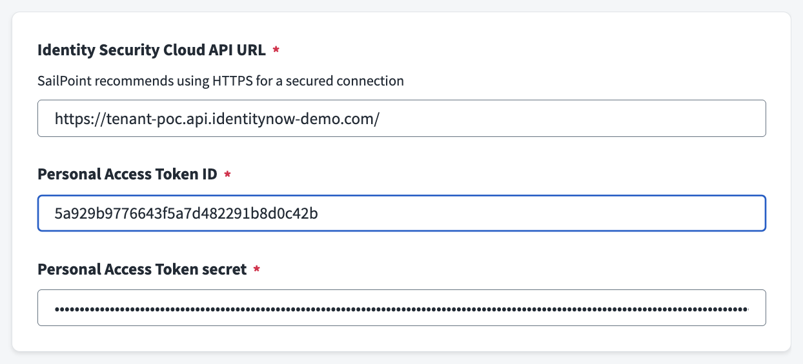

<!-- PLACEHOLDER: Screenshot of Connection Settings configuration interface. Save as docs/assets/images/config-connection-settings.png -->

| Field                               | Description                 | Required | Notes                                                                                 |
| ----------------------------------- | --------------------------- | -------- | ------------------------------------------------------------------------------------- |
| **Identity Security Cloud API URL** | Base URL of your ISC tenant | Yes      | Format: `https://<tenant>.api.identitynow.com`                                        |
| **Personal Access Token ID**        | Client ID from your PAT     | Yes      | Must have required API permissions for sources, identities, accounts, workflows/forms |
| **Personal Access Token secret**    | Client secret from your PAT | Yes      | Keep secure; rotate as needed                                                         |

For API request retries, requests per second, and queue settings, see **Advanced Settings**.

### Source Settings

Controls which identities and sources are in scope and how processing is managed.

#### Scope Section

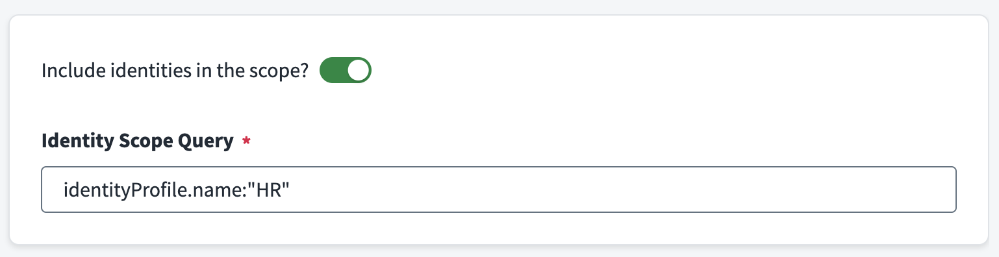

<!-- PLACEHOLDER: Screenshot of Scope section showing identity inclusion and query fields. Save as docs/assets/images/config-source-scope.png -->

| Field                                | Description                                                                | Required                              | Notes                                                                                                                                                                                     |
| ------------------------------------ | -------------------------------------------------------------------------- | ------------------------------------- | ----------------------------------------------------------------------------------------------------------------------------------------------------------------------------------------- |
| **Include identities in the scope?** | Include identities in addition to managed accounts from configured sources | No                                    | Enable for identity-only attribute generation or to define the baseline for deduplication (sources scope = managed accounts from configured sources).                                     |
| **Identity Scope Query**             | Search/filter query to limit which identities are evaluated                | Yes (when include identities enabled) | Uses [ISC search syntax](https://documentation.sailpoint.com/saas/help/search/building-query.html); examples: `*` (all), `attributes.cloudLifecycleState:active`, `source.name:"Workday"` |

#### Sources Section

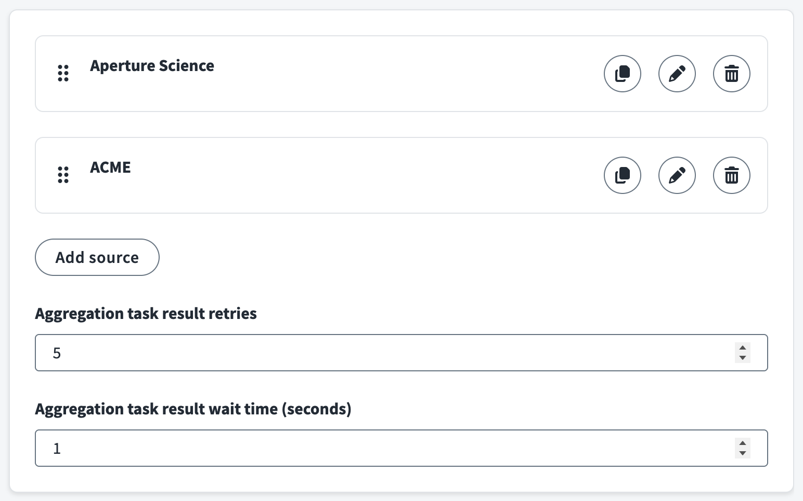

<!-- PLACEHOLDER: Screenshot of Sources section with source list and configuration. Save as docs/assets/images/config-source-sources.png -->

| Field                                           | Description                                                 | Required | Notes                                                                    |
| ----------------------------------------------- | ----------------------------------------------------------- | -------- | ------------------------------------------------------------------------ |
| **Authoritative account sources**               | List of sources whose accounts will be merged and evaluated | Yes      | Each source has sub-configuration (see below)                            |
| **Aggregation task result retries**             | Number of times to poll aggregation task status             | No       | Default: 5; applies to all sources with force aggregation enabled        |
| **Aggregation task result wait time (seconds)** | Wait time between aggregation task status checks            | No       | Default: 1 second; applies to all sources with force aggregation enabled |

**Per-source configuration:**

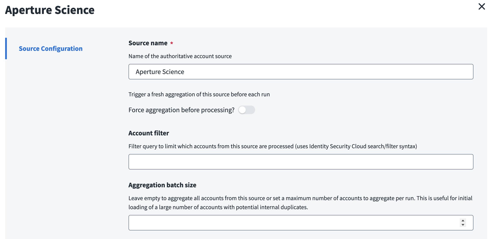

| Field                                    | Description                                              | Required | Notes                                                                                                                                                                                                                                  |
| ---------------------------------------- | -------------------------------------------------------- | -------- | -------------------------------------------------------------------------------------------------------------------------------------------------------------------------------------------------------------------------------------- |
| **Source name**                          | Name of the authoritative account source                 | Yes      | Must match the source name in ISC exactly (case-sensitive)                                                                                                                                                                             |
| **Force aggregation before processing?** | Trigger fresh aggregation of this source before each run | No       | Ensures current data but increases runtime. Useful for deduplication; also convenient when generating unique IDs for an authoritative source so its aggregation syncs with Fusion and new data gets identifiers as soon as it arrives. |
| **Account filter**                       | Filter query to limit which accounts are processed       | No       | Uses ISC search/filter syntax; example: `attributes.department:"Engineering"`                                                                                                                                                          |
| **Aggregation batch size**               | Maximum accounts to aggregate per run                    | No       | Leave empty for all accounts; useful for initial loading of large datasets with internal duplicates                                                                                                                                    |

#### Processing Control Section

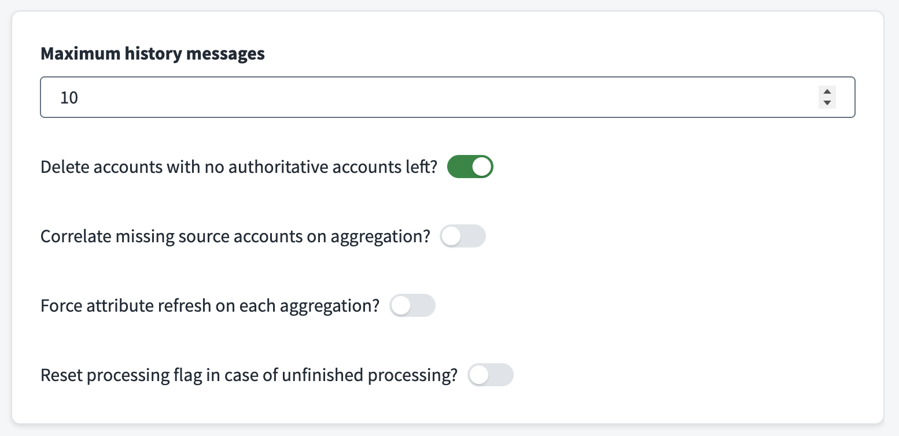

<!-- PLACEHOLDER: Screenshot of Processing Control section. Save as docs/assets/images/config-source-processing.png -->

| Field                                                       | Description                                                              | Required | Notes                                                                                                                                                                                        |
| ----------------------------------------------------------- | ------------------------------------------------------------------------ | -------- | -------------------------------------------------------------------------------------------------------------------------------------------------------------------------------------------- |
| **Maximum history messages**                                | Maximum history entries retained per Fusion account                      | No       | Default: 10; older entries are discarded when limit exceeded                                                                                                                                 |
| **Delete accounts with no authoritative accounts left?**    | Remove Fusion accounts when all contributing source accounts are removed | No       | Useful for automated cleanup when users leave                                                                                                                                                |
| **Correlate missing source accounts on aggregation?**       | Attempt to correlate new/missing source accounts each run                | No       | Default: true; helps with incremental correlation                                                                                                                                            |
| **Force attribute refresh on each aggregation?**            | Force Normal-type attributes to refresh every run                        | No       | Applies only to Normal attributes; Unique attributes are only computed when a Fusion account is first created or when an existing account is activated. Can be expensive for large datasets. |
| **Reset processing flag in case of unfinished processing?** | Clear stuck processing state from prior incomplete run                   | No       | Use when a previous run left accounts in processing state                                                                                                                                    |

### Attribute Mapping Settings

Controls how source account attributes are mapped into the Fusion account and how values from multiple sources are merged.

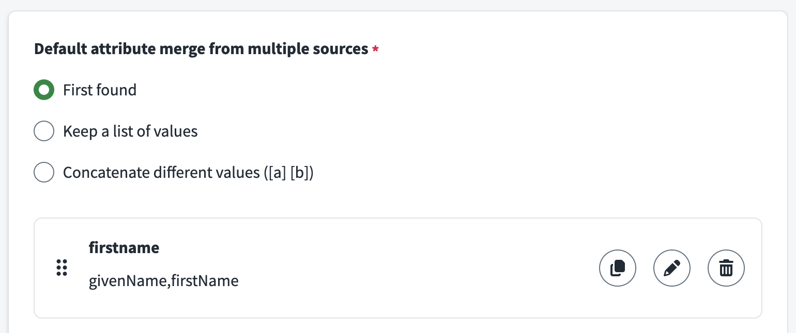

<!-- PLACEHOLDER: Screenshot of Attribute Mapping Settings menu. Save as docs/assets/images/config-attribute-mapping.png -->

#### Attribute Mapping Definitions Section

| Field                                             | Description                                                | Required | Notes                                                                                                                                                                                |
| ------------------------------------------------- | ---------------------------------------------------------- | -------- | ------------------------------------------------------------------------------------------------------------------------------------------------------------------------------------ |
| **Default attribute merge from multiple sources** | Default method for combining values from different sources | Yes      | Options: **First found** (first value by source order), **Keep a list of values** (distinct values as array), **Concatenate different values** (distinct values as `[a] [b]` string) |
| **Attribute Mapping**                             | List of attribute mappings                                 | No       | Each mapping defines how source attributes feed a Fusion attribute                                                                                                                   |

**Per-attribute mapping configuration:**

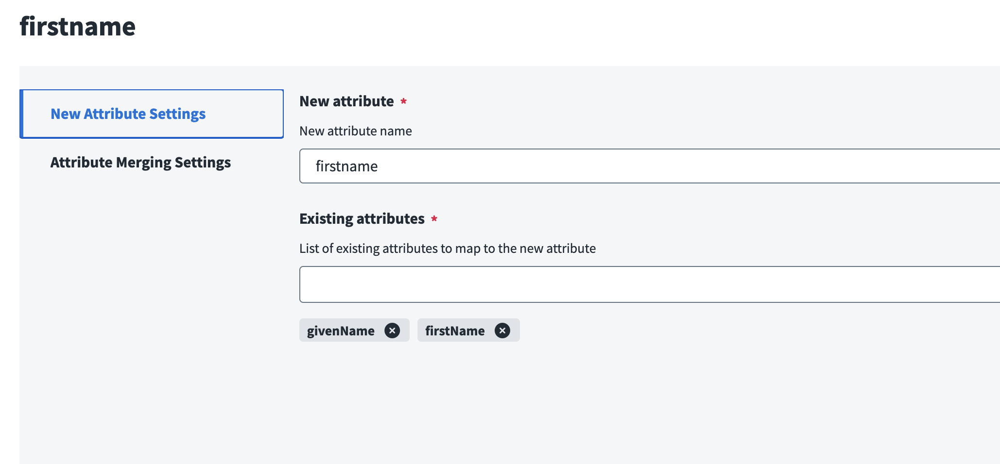

| Field                                                        | Description                                             | Required                | Notes                                                                          |
| ------------------------------------------------------------ | ------------------------------------------------------- | ----------------------- | ------------------------------------------------------------------------------ |
| **New attribute**                                            | Name of the attribute on the Fusion account             | Yes                     | Will appear in the discovered schema                                           |
| **Existing attributes**                                      | List of source attribute names that feed this attribute | Yes                     | Names must match source account schema (case-sensitive)                        |
| **Default attribute merge from multiple sources** (override) | Override default merge for this specific mapping        | No                      | Same options as default, plus **Source name** (use value from specific source) |
| **Source name**                                              | Specific source to use for this attribute               | Yes (when merge=source) | Takes precedence when multiple sources have values                             |

### Attribute Definition Settings

Controls how attributes are generated, including unique identifiers, UUIDs, counters, and Velocity-based computed attributes.

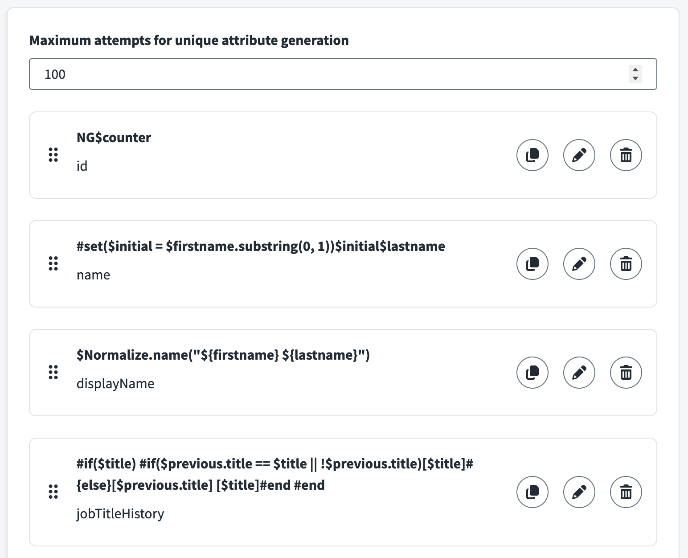

<!-- PLACEHOLDER: Screenshot of Attribute Definition Settings menu. Save as docs/assets/images/config-attribute-definition.png -->

#### Attribute Definition Settings Section

| Field                                                | Description                                                | Required | Notes                                                        |
| ---------------------------------------------------- | ---------------------------------------------------------- | -------- | ------------------------------------------------------------ |
| **Maximum attempts for unique attribute generation** | Maximum attempts to generate unique value before giving up | No       | Default: 100; prevents infinite loops with unique/UUID types |
| **Attribute Definitions**                            | List of attribute generation rules                         | No       | Each definition specifies how an attribute is built          |

**Per-attribute definition configuration:**

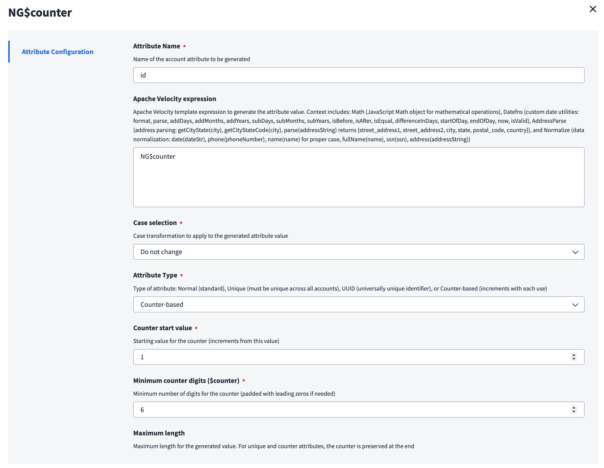

| Field                                 | Description                                         | Required                   | Notes                                                                                                                                                                                                                                                                                                                                              |
| ------------------------------------- | --------------------------------------------------- | -------------------------- | -------------------------------------------------------------------------------------------------------------------------------------------------------------------------------------------------------------------------------------------------------------------------------------------------------------------------------------------------- |
| **Attribute Name**                    | Name of the account attribute to generate           | Yes                        | Will appear in the discovered schema                                                                                                                                                                                                                                                                                                               |
| **Apache Velocity expression**        | Template expression to generate the attribute value | No                         | Context includes: mapped account attributes, `$Math`, `$Datefns` (format, parse, add/sub days/months/years, isBefore, isAfter, differenceInDays, etc.), `$AddressParse` (getCityState, getCityStateCode, parse), `$Normalize` (date, phone, name, fullName, ssn, address). Example: `#set($initial = $firstname.substring(0, 1))$initial$lastname` |
| **Case selection**                    | Case transformation to apply                        | Yes                        | Options: **Do not change**, **Lower case**, **Upper case**, **Capitalize**                                                                                                                                                                                                                                                                         |
| **Attribute Type**                    | Type of attribute                                   | Yes                        | **Normal** (standard attribute), **Unique** (must be unique across accounts; counter added if collision), **UUID** (generates immutable UUID), **Counter-based** (increments with each use)                                                                                                                                                        |
| **Counter start value**               | Starting value for counter                          | Yes (counter type)         | Example: 1, 1000, etc.                                                                                                                                                                                                                                                                                                                             |
| **Minimum counter digits ($counter)** | Minimum digits for counter (zero-padded)            | Yes (counter/unique types) | Example: 3 → `001`, `002`; for unique type, counter is appended on collision                                                                                                                                                                                                                                                                       |
| **Maximum length**                    | Maximum length for generated value                  | No                         | Truncates to this length; for unique/counter types, counter is preserved at end                                                                                                                                                                                                                                                                    |
| **Normalize special characters?**     | Remove special characters and quotes                | No                         | Useful for IDs and usernames                                                                                                                                                                                                                                                                                                                       |
| **Remove spaces?**                    | Remove all spaces from value                        | No                         | Useful for IDs and usernames                                                                                                                                                                                                                                                                                                                       |
| **Refresh on each aggregation?**      | Recalculate value every aggregation                 | No                         | Only available for **Normal** type; unique/UUID/counter preserve state                                                                                                                                                                                                                                                                             |

**Note:** When an account is **enabled**, all attributes (including unique) are force refreshed and recalculated (internal mechanism to reset unique attributes).

### Fusion Settings

Controls deduplication behavior, including similarity matching and manual review workflows.

#### Matching Settings Section

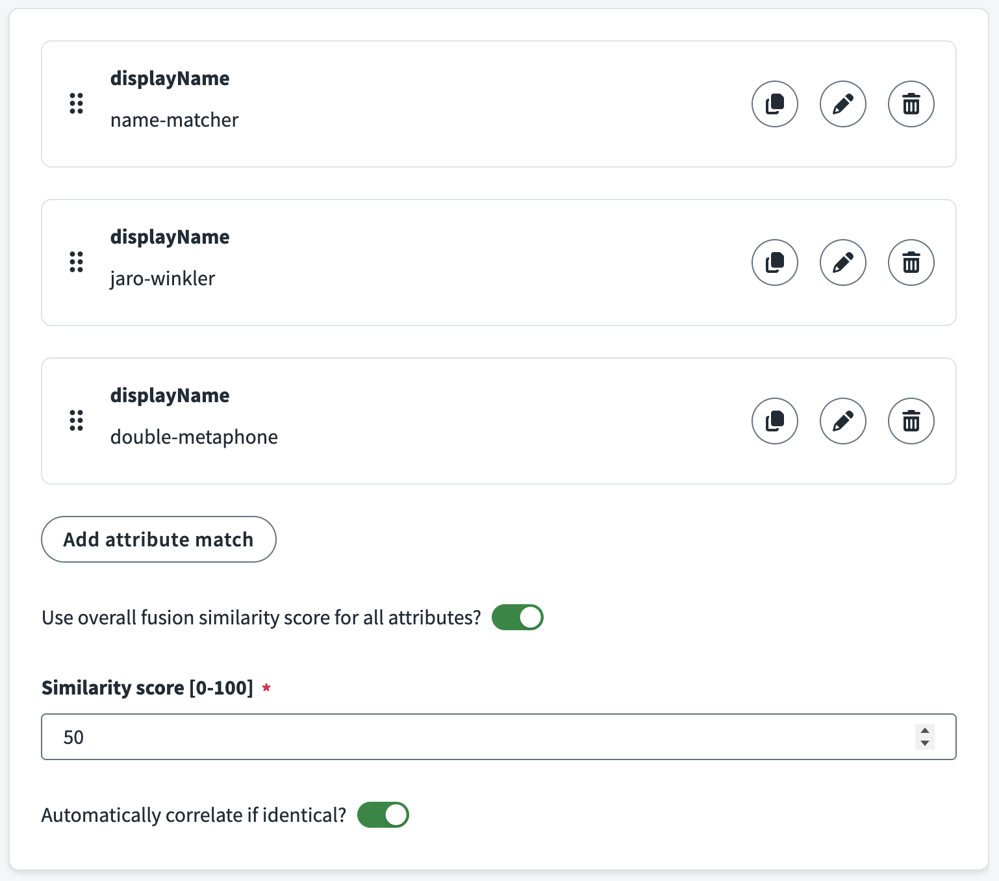

<!-- PLACEHOLDER: Screenshot of Matching Settings section. Save as docs/assets/images/config-fusion-matching.png -->

| Field                                                       | Description                                                    | Required                         | Notes                                                                                                                                                                                    |
| ----------------------------------------------------------- | -------------------------------------------------------------- | -------------------------------- | ---------------------------------------------------------------------------------------------------------------------------------------------------------------------------------------- |
| **Fusion attribute matches**                                | List of identity attributes to compare for duplicate detection | Yes                              | At least one attribute match required; each match specifies an attribute and algorithm                                                                                                   |
| **Use overall fusion similarity score for all attributes?** | Use single overall score instead of per-attribute thresholds   | No                               | When enabled, only the overall (average) threshold must be met; when disabled, every mandatory attribute must match, and if none are mandatory, all attributes are treated as mandatory. |
| **Similarity score [0-100]**                                | Minimum overall similarity score for auto-correlation          | Yes (when overall score enabled) | Typical range: 70-90; higher = stricter; only used when "Use overall fusion similarity score" is enabled                                                                                 |
| **Automatically correlate if identical?**                   | Auto-merge when attributes meet criteria without manual review | No                               | Use when you trust the algorithm and thresholds; skips manual review for high-confidence matches                                                                                         |

**Per-attribute match configuration:**

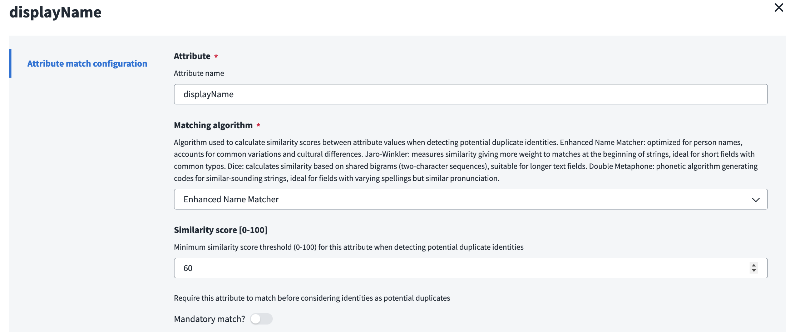

| Field                        | Description                                                     | Required | Notes                                                                                                                                                                                                                                                                                                                  |
| ---------------------------- | --------------------------------------------------------------- | -------- | ---------------------------------------------------------------------------------------------------------------------------------------------------------------------------------------------------------------------------------------------------------------------------------------------------------------------- |
| **Attribute**                | Identity attribute name to compare                              | Yes      | Must exist on identities in scope                                                                                                                                                                                                                                                                                      |
| **Matching algorithm**       | Algorithm for similarity calculation                            | Yes      | **Enhanced Name Matcher** (person names, handles variations), **Jaro-Winkler** (short strings with typos, emphasizes beginning), **Dice** (longer text, bigram-based), **Double Metaphone** (phonetic, similar pronunciation), **Custom** (from SaaS customizer)                                                       |
| **Similarity score [0-100]** | Minimum similarity score for this attribute                     | No       | Required when not using overall score mode. A mandatory attribute must meet or exceed this threshold or the match fails. When overall score is enabled, only the overall threshold is required (per-attribute thresholds may not all be met). When no attribute is mandatory, all attributes are treated as mandatory. |
| **Mandatory match?**         | Require this attribute to match before considering as duplicate | No       | When Yes: this attribute's score must be ≥ its threshold or the match fails. When No: attribute still has a threshold; when overall score is disabled and no attribute is mandatory, every attribute is effectively mandatory (all must meet thresholds).                                                              |

#### Review Settings Section

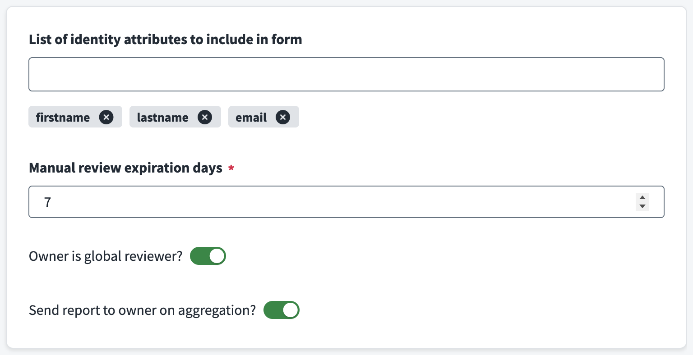

<!-- PLACEHOLDER: Screenshot of Review Settings section. Save as docs/assets/images/config-fusion-review.png -->

| Field                                              | Description                                      | Required | Notes                                                                                                                                                                                                                                              |
| -------------------------------------------------- | ------------------------------------------------ | -------- | -------------------------------------------------------------------------------------------------------------------------------------------------------------------------------------------------------------------------------------------------- |
| **List of identity attributes to include in form** | Attributes shown on manual review form           | No       | Helps reviewers make informed decisions; examples: name, email, department, hire date                                                                                                                                                              |
| **Manual review expiration days**                  | Days before review form expires                  | Yes      | Default: 7; ensures timely resolution                                                                                                                                                                                                              |
| **Owner is global reviewer?**                      | Add Fusion source owner as reviewer to all forms | No       | Ensures at least one reviewer is always assigned. For migration scenarios, it is recommended **not** to enable this until after the initial validation run has succeeded, so that review workflows cannot interfere with the first migration pass. |
| **Send report to owner on aggregation?**           | Email report to owner after each aggregation     | No       | Includes potential duplicates and processing summary                                                                                                                                                                                               |

### Advanced Settings

Fine-tuning for API behavior, resilience, debugging, and proxy mode.

<!-- PLACEHOLDER: Screenshot of Advanced Settings menu with all subsections. Save as docs/assets/images/config-advanced-settings.png -->

#### Developer Settings Section

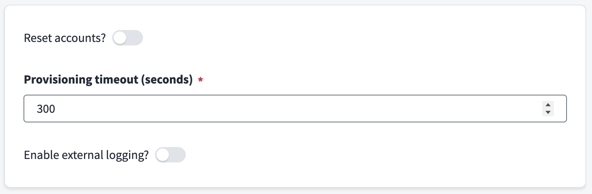

<!-- PLACEHOLDER: Screenshot of Developer Settings section. Save as docs/assets/images/config-advanced-developer.png -->

| Field                        | Description                                                   | Required                                    | Notes                                                                                        |
| ---------------------------- | ------------------------------------------------------------- | ------------------------------------------- | -------------------------------------------------------------------------------------------- |
| **Reset accounts?**          | Force rebuild of all Fusion accounts from scratch on next run | No                                          | **Use with caution in production**; useful for testing config changes; disable after one run |
| **Enable external logging?** | Send connector logs to external endpoint                      | No                                          | For centralized monitoring and analysis                                                      |
| **External logging URL**     | Endpoint URL for external logs                                | No (required when external logging enabled) | HTTPS recommended                                                                            |
| **External logging level**   | Minimum log level to send externally                          | No (required when external logging enabled) | Options: **Error**, **Warn**, **Info**, **Debug**                                            |

#### Advanced Connection Settings Section

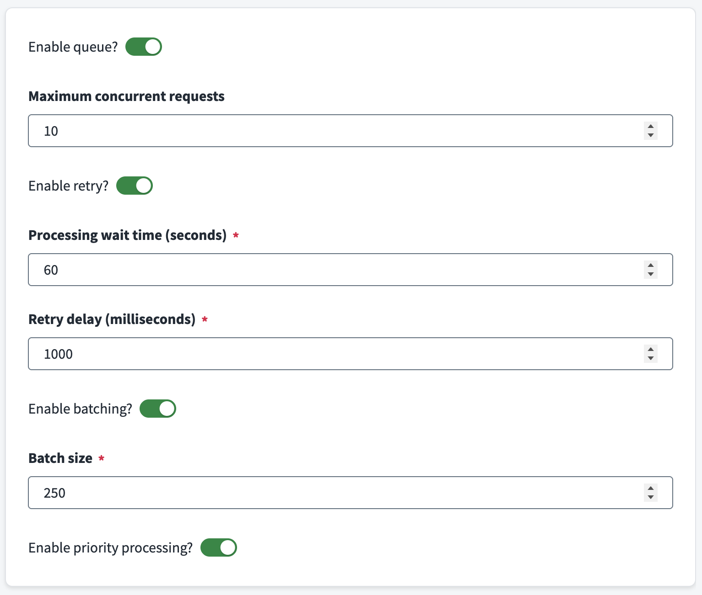

<!-- PLACEHOLDER: Screenshot of Advanced Connection Settings section. Save as docs/assets/images/config-advanced-connection.png -->

| Field                              | Description                                    | Required                         | Notes                                                                             |
| ---------------------------------- | ---------------------------------------------- | -------------------------------- | --------------------------------------------------------------------------------- |
| **Provisioning timeout (seconds)** | Maximum wait time for provisioning operations  | Yes                              | Default: 300; increase for large batches or slow APIs                             |
| **Enable queue?**                  | Enable queue management for API requests       | No                               | Enables rate limiting and concurrency control                                     |
| **Maximum concurrent requests**    | Maximum simultaneous API requests              | No (required when queue enabled) | Default: 10; adjust based on API capacity and tenant limits                       |
| **Enable retry?**                  | Enable automatic retry for failed API requests | No                               | Recommended for production; handles transient failures                            |
| **Processing wait time (seconds)** | Reserved for future use                        | Yes                              | Default: 60; not used for tuning—reserved for future scheduling features          |
| **Retry delay (milliseconds)**     | Base delay between retry attempts              | Yes                              | Default: 1000; for HTTP 429, uses `Retry-After` header when present               |
| **Enable batching?**               | Group requests in queue for better throughput  | No                               | Can improve efficiency for bulk operations                                        |
| **Batch size**                     | Requests per batch                             | Yes (when batching enabled)      | Default: 250; adjust based on operation type and payload size                     |
| **Enable priority processing?**    | Prioritize important requests in queue         | No                               | Default: enabled when queue is enabled; ensures critical operations process first |

#### Proxy Settings Section

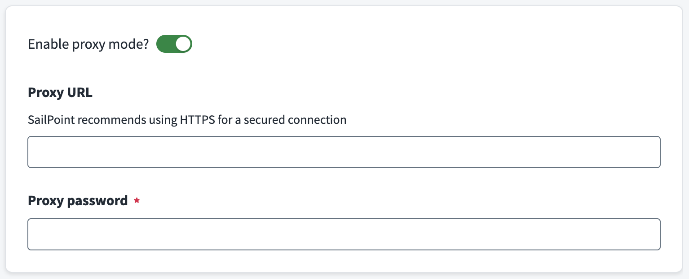

<!-- PLACEHOLDER: Screenshot of Proxy Settings section. Save as docs/assets/images/config-advanced-proxy.png -->

| Field                  | Description                                  | Required                         | Notes                                                                                |
| ---------------------- | -------------------------------------------- | -------------------------------- | ------------------------------------------------------------------------------------ |
| **Enable proxy mode?** | Delegate all processing to external endpoint | No                               | For running connector logic on your own infrastructure                               |
| **Proxy URL**          | URL of external proxy endpoint               | No (required when proxy enabled) | Must accept POST with command type, input, and config                                |
| **Proxy password**     | Secret for proxy authentication              | Yes (when proxy enabled)         | Set same value as `PROXY_PASSWORD` environment variable on proxy server; keep secure |

---

For detailed field-by-field guidance and usage patterns, see the [usage guides](docs/guides/) linked above.

---

## Quick start

1. **Add the connector to ISC** — Upload the Identity Fusion NG connector (e.g. via SailPoint CLI or your organization's process).
2. **Create a source** — In Admin → Connections → Sources, create a new source using the Identity Fusion NG connector. Mark it **Authoritative** when you need deduplication (so Fusion decides which incoming accounts create new identities vs. correlate to existing ones). For attribute generation only, Fusion is rarely authoritative.
3. **Configure connection** — Set Identity Security Cloud API URL and Personal Access Token (ID and secret). Use **Review and Test** to verify connectivity.
4. **Configure the connector** — Depending on your goal:
    - **Attribute generation only:** Set [Source Settings](docs/guides/attribute-generation.md) (identity scope and/or sources), [Attribute Mapping](docs/guides/attribute-management.md), and [Attribute Definitions](docs/guides/attribute-management.md).
    - **Deduplication:** Configure [sources and baseline](docs/guides/deduplication.md), then [Fusion Settings](docs/guides/deduplication.md) (matching and review).
5. **Discover schema** — Run **Discover Schema** so ISC has the combined account schema.
6. **Identity profile and aggregation** — Create an identity profile and provisioning plan as required by ISC, then run entitlement and account aggregation.

For step-by-step instructions and UI details, see the [attribute generation](docs/guides/attribute-generation.md) and [deduplication](docs/guides/deduplication.md) guides.

---

## Contributing

Contributions are welcome. Please open an issue or pull request in the repository. Do not forget to add or update tests and documentation as needed.

## License

Distributed under the MIT License. See [LICENSE.txt](LICENSE.txt) for more information.
